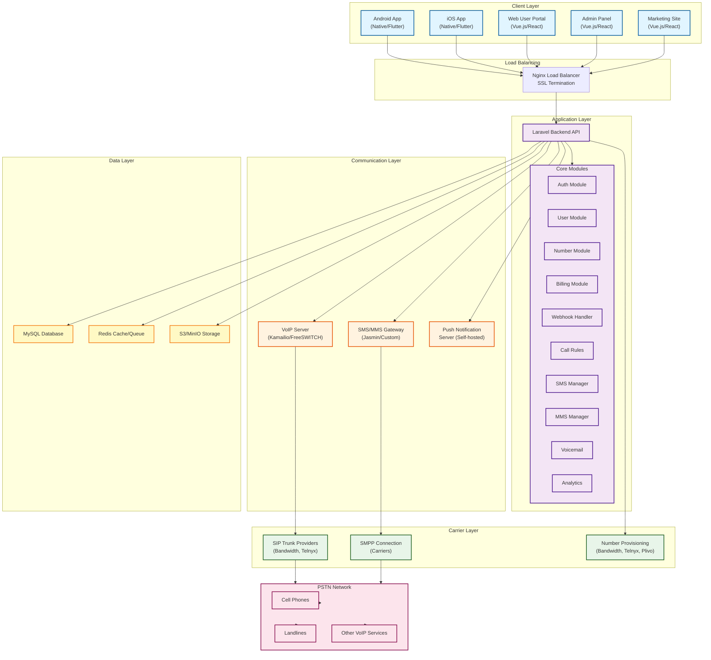

# High-Level System Architecture

## Overview
This diagram shows the complete system architecture with all major layers and components.

## Architecture Diagram

## Layer Descriptions

### Client Layer
- **Mobile Apps**: Native or Flutter apps for Android and iOS with SIP client integration
- **Web Portal**: User-facing web application for account management
- **Admin Panel**: Administrative interface for platform management
- **Marketing Site**: Public-facing website for customer acquisition

### Application Layer
- **Laravel Backend**: RESTful API server handling all business logic
- **Core Modules**: Modular architecture for different features

### Communication Layer
- **VoIP Server**: Handles SIP signaling and media processing
- **SMS/MMS Gateway**: Manages text messaging through SMPP protocol
- **Push Notifications**: Self-hosted push notification service

### Carrier Layer
- **SIP Trunks**: Connect to PSTN for voice calls
- **SMPP Connections**: Direct carrier connections for SMS/MMS
- **DID Providers**: Number provisioning and management

### Data Layer
- **MySQL**: Primary relational database
- **Redis**: Caching and queue management
- **S3/MinIO**: Object storage for media files

## Key Features

1. **Fully In-House**: No dependency on Twilio or Firebase
2. **Scalable**: Horizontal scaling at each layer
3. **Secure**: TLS/SRTP encryption throughout
4. **White-Label Ready**: Complete customization support
