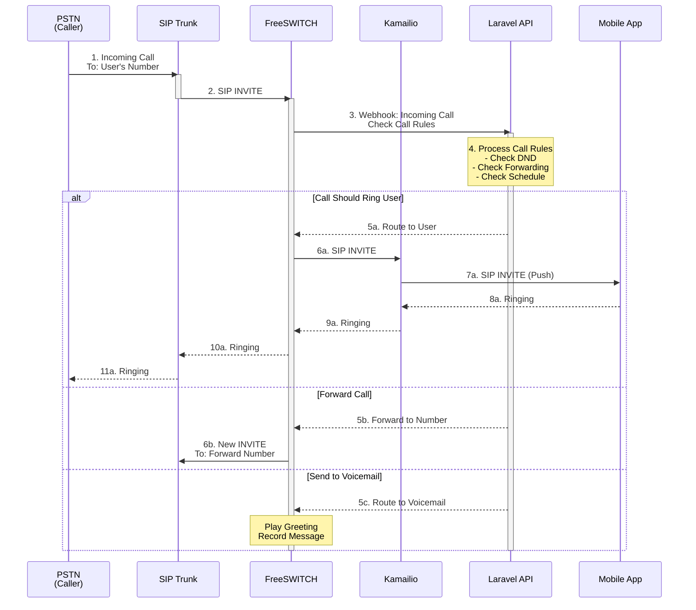

# VoIP Call Flow

## Overview
This diagram shows the complete flow of a VoIP call from mobile app to PSTN network.

## Call Flow Sequence

```mermaid
sequenceDiagram
    participant App as Mobile App<br/>(SIP Client)
    participant Kamailio as Kamailio<br/>SIP Proxy
    participant FreeSWITCH as FreeSWITCH<br/>Media Server
    participant SIPTrunk as SIP Trunk<br/>(Bandwidth/Telnyx)
    participant PSTN as PSTN<br/>(Cell/Landline)

    Note over App,PSTN: Outbound Call Flow

    App->>Kamailio: 1. SIP INVITE (TLS/WSS)<br/>From: User's Number<br/>To: Destination Number
    
    activate Kamailio
    Note over Kamailio: 2. Authenticate User<br/>Validate Credentials<br/>Check Permissions
    
    Kamailio->>FreeSWITCH: 3. Forward SIP INVITE<br/>Route to Media Server
    deactivate Kamailio
    
    activate FreeSWITCH
    Note over FreeSWITCH: 4. Setup Media Session<br/>Allocate RTP Ports<br/>Prepare Codecs
    
    FreeSWITCH->>SIPTrunk: 5. SIP INVITE to Trunk<br/>Originate Call
    deactivate FreeSWITCH
    
    activate SIPTrunk
    SIPTrunk->>PSTN: 6. Connect to PSTN<br/>Route to Destination
    
    PSTN-->>SIPTrunk: 7. Ringing (180)
    SIPTrunk-->>FreeSWITCH: 8. Ringing (180)
    FreeSWITCH-->>Kamailio: 9. Ringing (180)
    Kamailio-->>App: 10. Ringing (180)
    
    PSTN-->>SIPTrunk: 11. Call Answered (200 OK)
    SIPTrunk-->>FreeSWITCH: 12. Call Answered (200 OK)
    deactivate SIPTrunk
    
    activate FreeSWITCH
    FreeSWITCH-->>Kamailio: 13. Call Answered (200 OK)
    Kamailio-->>App: 14. Call Answered (200 OK)
    
    App->>Kamailio: 15. ACK
    Kamailio->>FreeSWITCH: 16. ACK
    FreeSWITCH->>SIPTrunk: 17. ACK
    SIPTrunk->>PSTN: 18. ACK
    
    Note over App,PSTN: Media Stream (RTP/SRTP)
    
    rect rgb(200, 255, 200)
        App<->>FreeSWITCH: Encrypted Voice (SRTP)<br/>AES-128/256
        FreeSWITCH<->>PSTN: Voice Media (RTP)<br/>Via SIP Trunk
    end
    
    Note over App,PSTN: Call in Progress
    
    App->>Kamailio: 19. BYE (End Call)
    Kamailio->>FreeSWITCH: 20. BYE
    FreeSWITCH->>SIPTrunk: 21. BYE
    SIPTrunk->>PSTN: 22. BYE
    
    PSTN-->>SIPTrunk: 23. 200 OK
    SIPTrunk-->>FreeSWITCH: 24. 200 OK
    FreeSWITCH-->>Kamailio: 25. 200 OK
    Kamailio-->>App: 26. 200 OK
    deactivate FreeSWITCH
    
    Note over App,PSTN: Call Ended - CDR Generated
```

## Inbound Call Flow



## Call Components

### 1. SIP Signaling (TLS/WSS)
- Authentication and authorization
- Call setup and teardown
- Status updates (ringing, answered, ended)

### 2. Media Stream (RTP/SRTP)
- Encrypted voice data
- Codec negotiation (Opus, G.711)
- NAT traversal (STUN/TURN)

### 3. Call Rules Processing
- Do Not Disturb (DND)
- Call forwarding (always, busy, no answer)
- Time-based routing
- Voicemail handling

## Key Features

1. **End-to-End Encryption**: TLS for signaling, SRTP for media
2. **Intelligent Routing**: Rule-based call handling
3. **High Availability**: Redundant SIP servers
4. **Quality Monitoring**: Real-time call quality metrics
