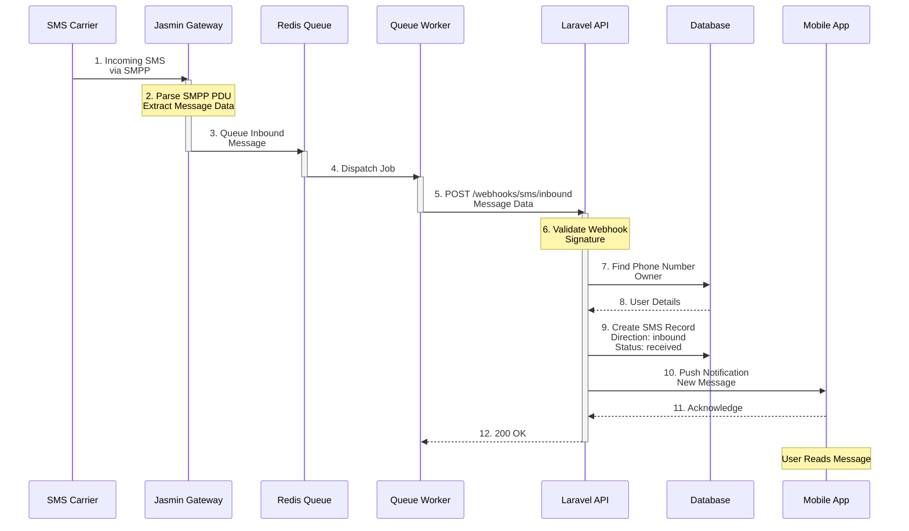
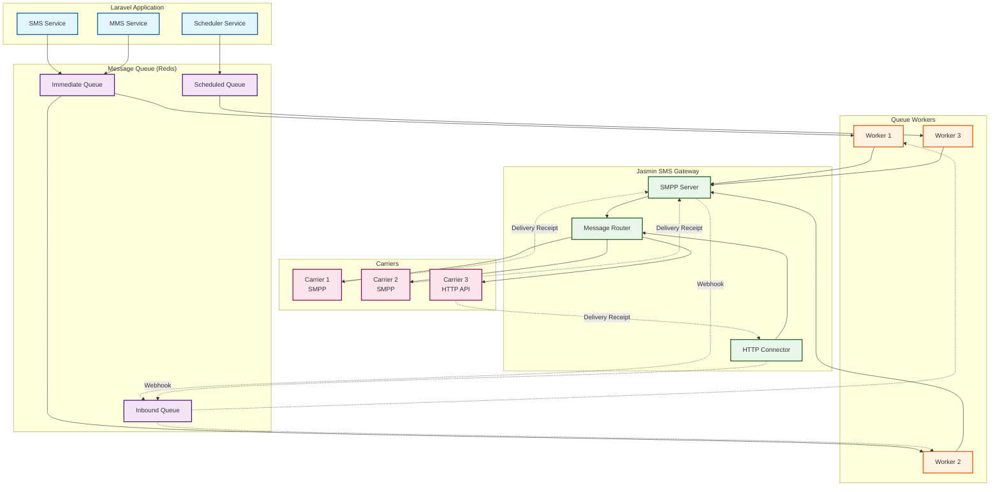

# SMS/MMS Workflow

## Overview
This diagram shows how SMS and MMS messages are processed through the platform.

## SMS Sending Workflow

```mermaid
graph TB
    Start([User Sends SMS]) --> Validate{Validate Request}
    
    Validate -->|Invalid| Error1[Return Error]
    Validate -->|Valid| CheckNumber{Verify Sender<br/>Number Ownership}
    
    CheckNumber -->|Not Owned| Error2[Unauthorized Error]
    CheckNumber -->|Owned| CheckBalance{Check Wallet<br/>Balance}
    
    CheckBalance -->|Insufficient| Error3[Insufficient Funds]
    CheckBalance -->|Sufficient| CalcCost[Calculate Cost<br/>Based on Segments]
    
    CalcCost --> CreateRecord[Create SMS Record<br/>Status: queued]
    
    CreateRecord --> Scheduled{Scheduled<br/>for Later?}
    
    Scheduled -->|Yes| ScheduleJob[Add to Scheduled<br/>Jobs Table]
    Scheduled -->|No| QueueImmediate[Queue for<br/>Immediate Sending]
    
    ScheduleJob --> WaitTime[Wait Until<br/>Scheduled Time]
    WaitTime --> QueueImmediate
    
    QueueImmediate --> Redis[(Redis Queue)]
    
    Redis --> Worker[Queue Worker<br/>Processes Job]
    
    Worker --> JasminGW[Jasmin SMS<br/>Gateway]
    
    JasminGW --> SelectCarrier{Select Best<br/>Carrier Route}
    
    SelectCarrier --> Carrier1[Carrier 1<br/>SMPP]
    SelectCarrier --> Carrier2[Carrier 2<br/>SMPP]
    SelectCarrier --> Carrier3[Carrier 3<br/>HTTP API]
    
    Carrier1 --> SendSMS[Send to SMPP<br/>Network]
    Carrier2 --> SendSMS
    Carrier3 --> SendSMS
    
    SendSMS --> UpdateStatus[Update Status:<br/>sent]
    
    UpdateStatus --> DeductWallet[Deduct from<br/>Wallet]
    
    DeductWallet --> CreateTransaction[Create Transaction<br/>Record]
    
    CreateTransaction --> WaitDelivery[Wait for Delivery<br/>Receipt]
    
    WaitDelivery --> DeliveryWebhook{Delivery<br/>Receipt}
    
    DeliveryWebhook -->|Delivered| UpdateDelivered[Status: delivered]
    DeliveryWebhook -->|Failed| UpdateFailed[Status: failed]
    
    UpdateDelivered --> NotifyUser[Push Notification<br/>to User]
    UpdateFailed --> RefundUser[Refund to Wallet]
    
    RefundUser --> NotifyUser
    NotifyUser --> End([Complete])

    classDef errorStyle fill:#ffcdd2,stroke:#c62828,stroke-width:2px
    classDef processStyle fill:#c8e6c9,stroke:#2e7d32,stroke-width:2px
    classDef decisionStyle fill:#fff9c4,stroke:#f57f17,stroke-width:2px
    classDef queueStyle fill:#e1bee7,stroke:#6a1b9a,stroke-width:2px

    class Error1,Error2,Error3,UpdateFailed,RefundUser errorStyle
    class CreateRecord,Worker,JasminGW,SendSMS,UpdateStatus,DeductWallet,CreateTransaction,UpdateDelivered processStyle
    class Validate,CheckNumber,CheckBalance,Scheduled,SelectCarrier,DeliveryWebhook decisionStyle
    class Redis,QueueImmediate,ScheduleJob queueStyle
```

## SMS Receiving Workflow

## MMS Sending Workflow

```mermaid
graph LR
    Start([User Sends MMS]) --> Upload[Upload Media<br/>to S3/MinIO]
    
    Upload --> Validate{Validate<br/>Media Type<br/>& Size}
    
    Validate -->|Invalid| Error[Return Error]
    Validate -->|Valid| CreateMMS[Create MMS Record]
    
    CreateMMS --> CreateMedia[Create MMS Media<br/>Records]
    
    CreateMedia --> CalcCost[Calculate Cost<br/>Higher than SMS]
    
    CalcCost --> CheckBalance{Check<br/>Balance}
    
    CheckBalance -->|Insufficient| Error
    CheckBalance -->|Sufficient| Queue[Queue for Sending]
    
    Queue --> Worker[Queue Worker]
    
    Worker --> Jasmin[Jasmin Gateway]
    
    Jasmin --> SendMMS[Send MMS via<br/>SMPP/HTTP]
    
    SendMMS --> Deduct[Deduct from<br/>Wallet]
    
    Deduct --> Complete([Complete])

    classDef errorStyle fill:#ffcdd2,stroke:#c62828,stroke-width:2px
    classDef processStyle fill:#c8e6c9,stroke:#2e7d32,stroke-width:2px

    class Error errorStyle
    class Upload,CreateMMS,CreateMedia,Worker,Jasmin,SendMMS,Deduct processStyle
```

## Message Queue Architecture

## Key Features

### SMS Features
1. **Scheduled Sending**: Queue messages for future delivery
2. **Segment Calculation**: Automatic handling of long messages
3. **Delivery Tracking**: Real-time delivery status updates
4. **Cost Optimization**: Intelligent carrier routing

### MMS Features
1. **Media Upload**: Support for images, videos, audio
2. **Size Validation**: Automatic file size checking
3. **Format Support**: Multiple media formats
4. **Higher Pricing**: Separate pricing model from SMS

### Queue Management
1. **Redis-based**: Fast, reliable message queuing
2. **Multiple Workers**: Parallel message processing
3. **Retry Logic**: Automatic retry on failures
4. **Priority Queues**: Immediate vs scheduled handling
