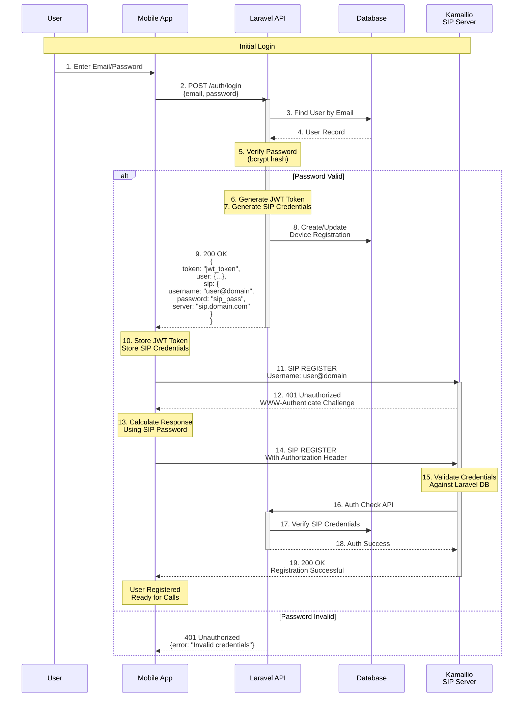
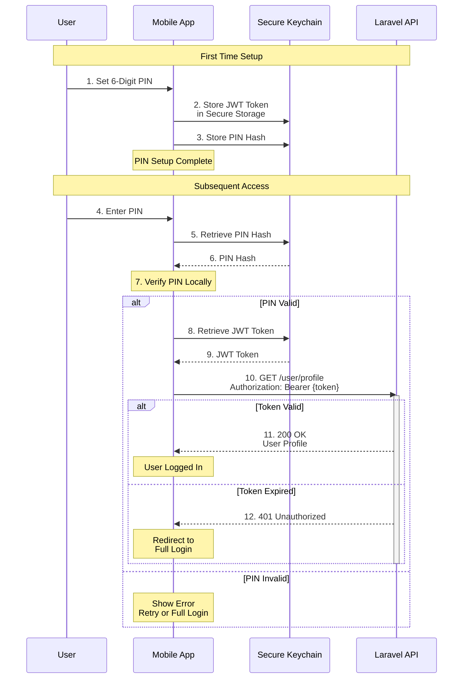
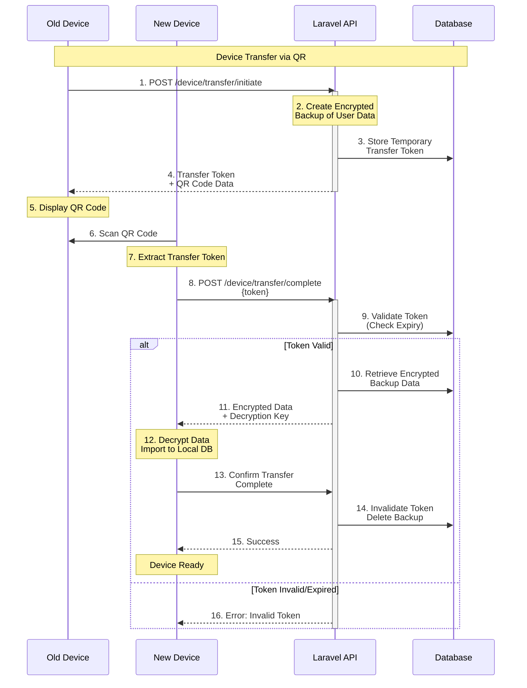
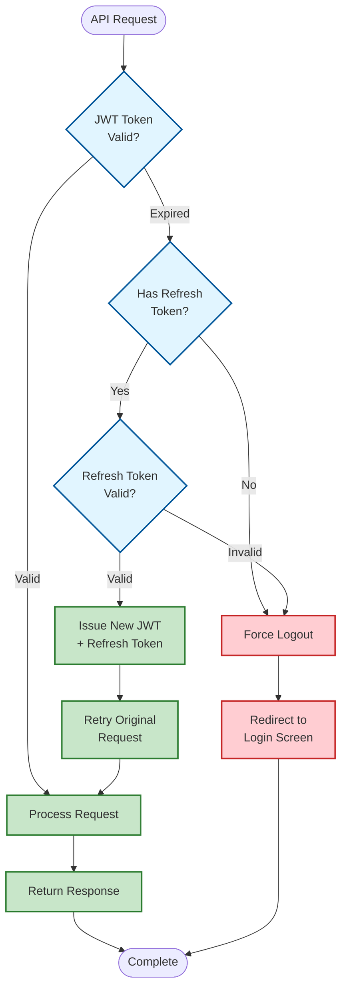
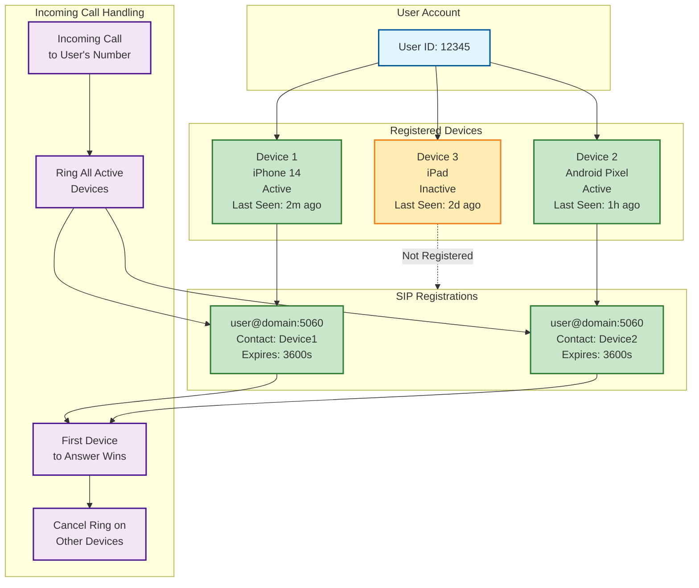

# Authentication Flow

## Overview
Complete authentication flow including user login, JWT token generation, and SIP registration.

## User Authentication Flow

## PIN-Based Quick Access

## QR Code Device Pairing

## Token Refresh Flow

## Multi-Device Session Management

## Security Features

### JWT Token
- **Expiry**: 1 hour (configurable)
- **Refresh Token**: 30 days
- **Algorithm**: RS256 (asymmetric)
- **Claims**: user_id, device_id, issued_at, expires_at

### SIP Credentials
- **Generated per device**: Unique credentials for each device
- **Stored securely**: Hashed in database
- **Auto-rotation**: Optional periodic rotation
- **Revocation**: Immediate on logout/device removal

### PIN Security
- **Local verification**: PIN never sent to server
- **Secure storage**: Keychain (iOS) / Keystore (Android)
- **Biometric option**: Face ID / Touch ID / Fingerprint
- **Attempt limiting**: Lock after failed attempts

### Device Pairing
- **Time-limited tokens**: 24-hour expiry
- **One-time use**: Token invalidated after use
- **Encrypted transfer**: AES-256 encryption
- **Audit logging**: All transfers logged
