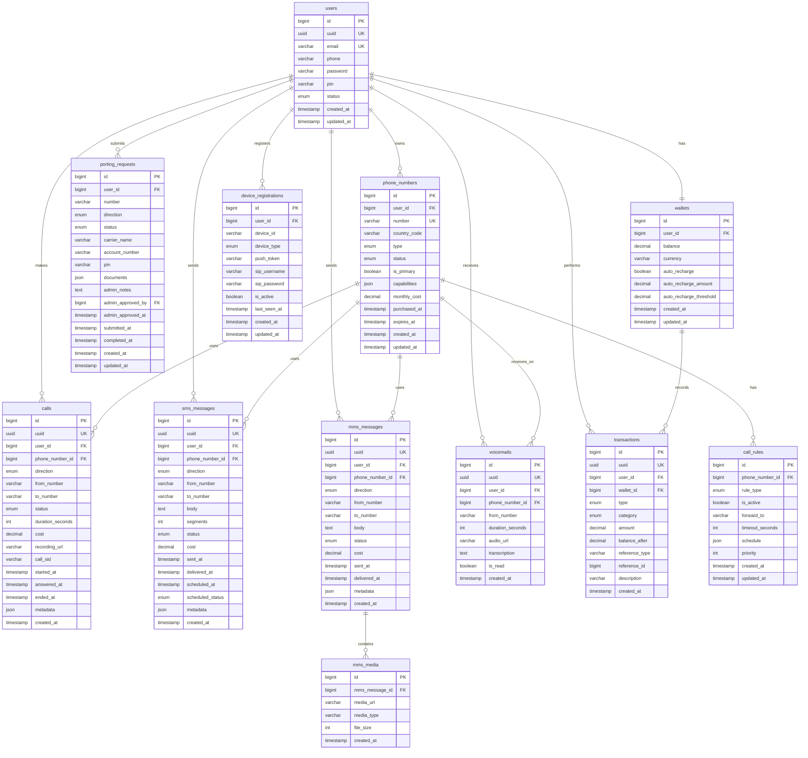

# Database Schema

## Overview
Entity-relationship diagram showing all database tables and their relationships.

## Complete Database Schema



## Table Relationships

### Core User Data
- **users**: Central user account table
- **device_registrations**: Multiple devices per user for SIP and push notifications
- **wallets**: One wallet per user for billing

### Phone Numbers
- **phone_numbers**: Virtual numbers owned by users (1-5 per user)
- **call_rules**: Forwarding and routing rules per number

### Communication Records
- **calls**: Voice call history (inbound/outbound)
- **sms_messages**: SMS message history with scheduling support
- **mms_messages**: MMS message history
- **mms_media**: Media attachments for MMS
- **voicemails**: Voicemail recordings and transcriptions

### Billing
- **wallets**: User balance and auto-recharge settings
- **transactions**: Complete transaction history with references

### Number Management
- **porting_requests**: Number porting workflow tracking

## Key Indexes

```sql
-- Performance Indexes
CREATE INDEX idx_calls_user_created ON calls(user_id, created_at DESC);
CREATE INDEX idx_calls_phone_number ON calls(phone_number_id, created_at DESC);
CREATE INDEX idx_calls_status ON calls(status);

CREATE INDEX idx_sms_user_created ON sms_messages(user_id, created_at DESC);
CREATE INDEX idx_sms_phone_number ON sms_messages(phone_number_id, created_at DESC);
CREATE INDEX idx_sms_scheduled ON sms_messages(scheduled_at) WHERE scheduled_status = 'pending';

CREATE INDEX idx_phone_numbers_user ON phone_numbers(user_id, status);
CREATE INDEX idx_phone_numbers_number ON phone_numbers(number);

CREATE INDEX idx_transactions_user ON transactions(user_id, created_at DESC);
CREATE INDEX idx_transactions_wallet ON transactions(wallet_id, created_at DESC);

CREATE INDEX idx_device_registrations_user ON device_registrations(user_id, is_active);
```

## Data Types Reference

### Enums

**User Status**
- `active`: Normal active user
- `suspended`: Temporarily suspended
- `deleted`: Soft deleted

**Phone Number Type**
- `local`: Local number
- `toll_free`: Toll-free number
- `mobile`: Mobile number

**Phone Number Status**
- `active`: Currently active
- `inactive`: Temporarily disabled
- `porting`: Being ported
- `released`: Released back to pool

**Call Direction**
- `inbound`: Incoming call
- `outbound`: Outgoing call

**Call Status**
- `initiated`: Call initiated
- `ringing`: Phone ringing
- `answered`: Call answered
- `completed`: Call completed normally
- `failed`: Call failed
- `busy`: Line busy
- `no_answer`: No answer

**Message Status**
- `queued`: Queued for sending
- `sent`: Sent to carrier
- `delivered`: Delivered to recipient
- `failed`: Delivery failed
- `received`: Received message

**Transaction Type**
- `credit`: Money added
- `debit`: Money deducted
- `refund`: Money refunded

**Transaction Category**
- `recharge`: Wallet recharge
- `call`: Call charges
- `sms`: SMS charges
- `mms`: MMS charges
- `number_purchase`: Number purchase
- `number_renewal`: Monthly renewal
- `porting`: Porting fees

**Porting Status**
- `pending`: Initial request
- `documents_uploaded`: Documents provided
- `admin_review`: Under admin review
- `approved`: Approved by admin
- `rejected`: Rejected by admin
- `submitted_to_carrier`: Sent to carrier
- `completed`: Porting complete
- `cancelled`: Request cancelled

**Device Type**
- `android`: Android device
- `ios`: iOS device
- `web`: Web browser

## Data Retention Policies

| Table | Retention Period | Notes |
|-------|------------------|-------|
| calls | 2 years | Regulatory requirement |
| sms_messages | 1 year | User data |
| mms_messages | 1 year | User data |
| voicemails | Until deleted by user | User-controlled |
| transactions | 7 years | Financial records |
| porting_requests | 5 years | Regulatory requirement |
