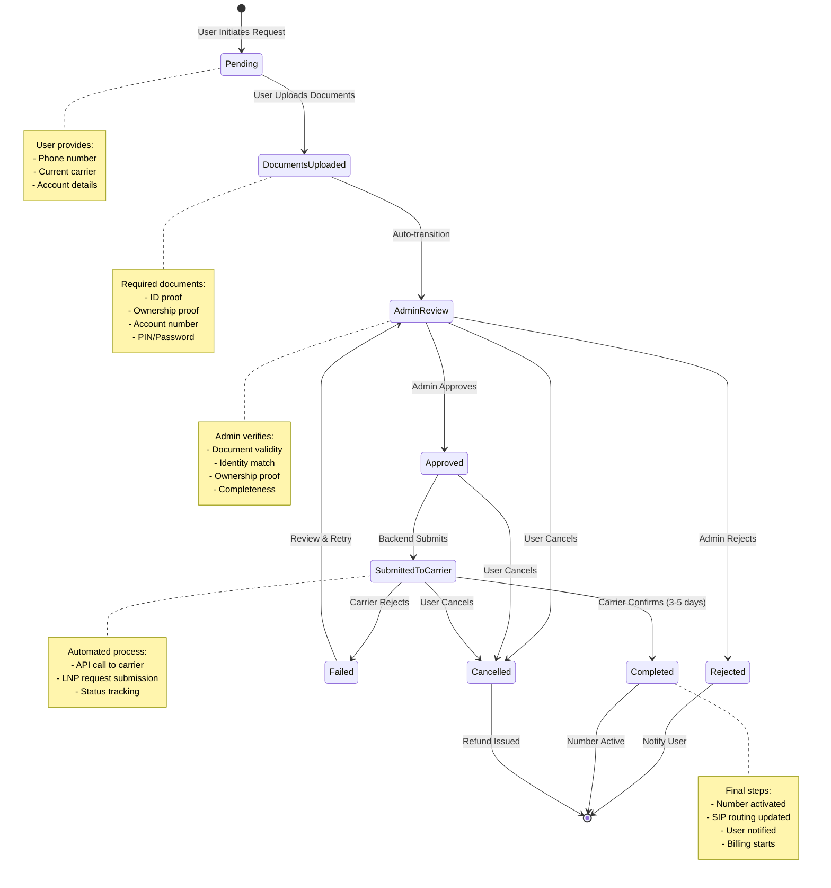
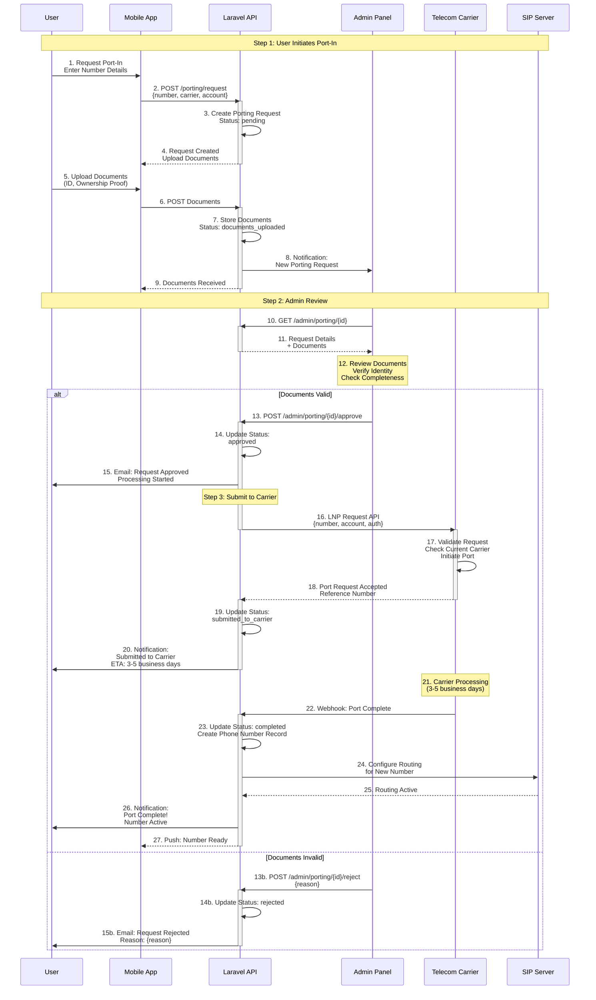
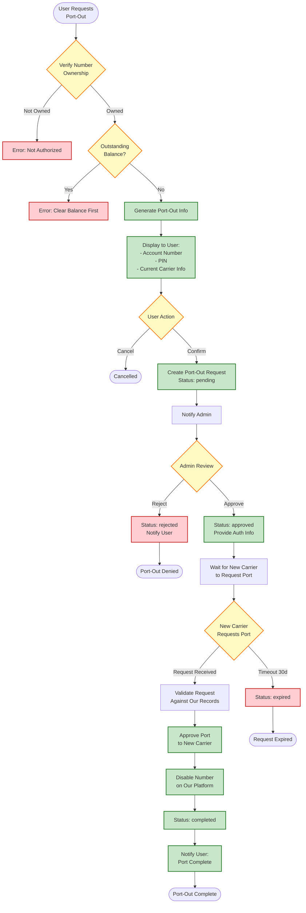
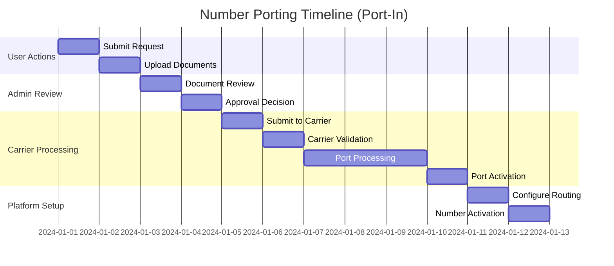

# Number Porting Workflow

## Overview
Complete workflow for porting phone numbers into and out of the platform.

## Port-In Workflow



## Port-In Sequence Diagram



## Port-Out Workflow



## Porting Timeline



## Porting Request States

| State | Description | User Actions | Admin Actions | Next States |
|-------|-------------|--------------|---------------|-------------|
| **pending** | Initial request created | Upload documents | - | documents_uploaded |
| **documents_uploaded** | Documents provided | Wait | Review documents | admin_review |
| **admin_review** | Under admin review | Wait | Approve/Reject | approved, rejected |
| **approved** | Admin approved | Wait | - | submitted_to_carrier |
| **rejected** | Admin rejected | Resubmit or cancel | - | - |
| **submitted_to_carrier** | Sent to carrier | Wait | Monitor | completed, failed |
| **failed** | Carrier rejected | Provide more info | Review & retry | admin_review |
| **completed** | Port successful | Use number | - | - |
| **cancelled** | User cancelled | - | - | - |

## Required Documents

### For Port-In
1. **Government-issued ID**
   - Passport
   - Driver's License
   - National ID Card

2. **Proof of Ownership**
   - Recent bill from current carrier
   - Account statement
   - Contract/Agreement

3. **Account Information**
   - Account number
   - PIN/Password (if applicable)
   - Billing address

### For Port-Out
1. **Account Number**: Provided by our platform
2. **PIN**: Generated for port-out authorization
3. **Carrier Information**: Our carrier details
4. **Billing Status**: Must be current (no outstanding balance)

## API Endpoints

```
POST   /api/v1/porting/request          # Initiate port-in
GET    /api/v1/porting/status/{id}      # Check status
POST   /api/v1/porting/{id}/documents   # Upload documents
DELETE /api/v1/porting/{id}             # Cancel request

# Admin endpoints
GET    /api/v1/admin/porting            # List all requests
GET    /api/v1/admin/porting/{id}       # View details
POST   /api/v1/admin/porting/{id}/approve   # Approve
POST   /api/v1/admin/porting/{id}/reject    # Reject
POST   /api/v1/admin/porting/{id}/submit    # Submit to carrier
```

## Notifications

### User Notifications
- Request received
- Documents uploaded successfully
- Admin review in progress
- Request approved/rejected
- Submitted to carrier
- Port completed
- Number active

### Admin Notifications
- New porting request
- Documents uploaded
- Carrier response received
- Port completion

## Error Handling

| Error | Cause | Resolution |
|-------|-------|------------|
| Invalid number format | Wrong format | Validate and resubmit |
| Number not portable | Landline/special number | Contact support |
| Missing documents | Incomplete upload | Upload missing docs |
| Carrier rejection | Account mismatch | Verify account details |
| Timeout | Carrier delay | Contact carrier support |
