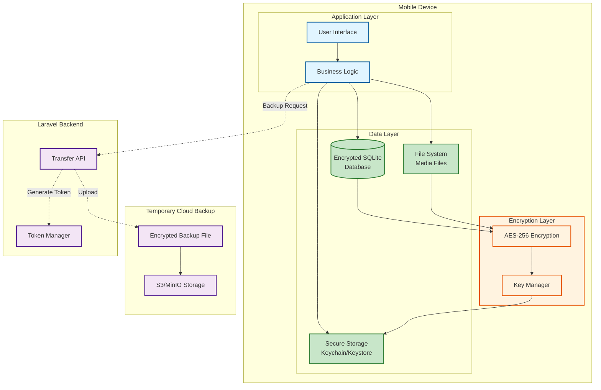
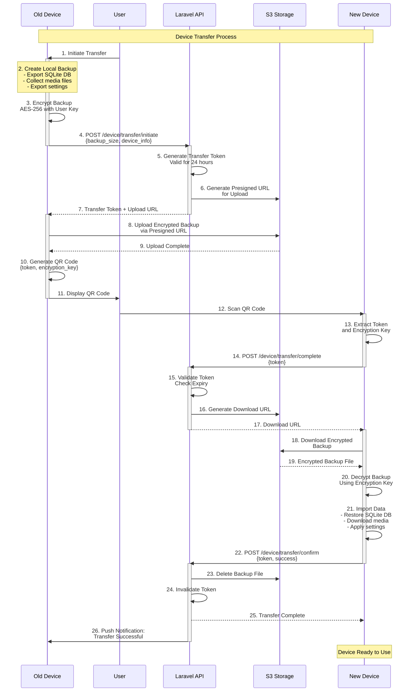
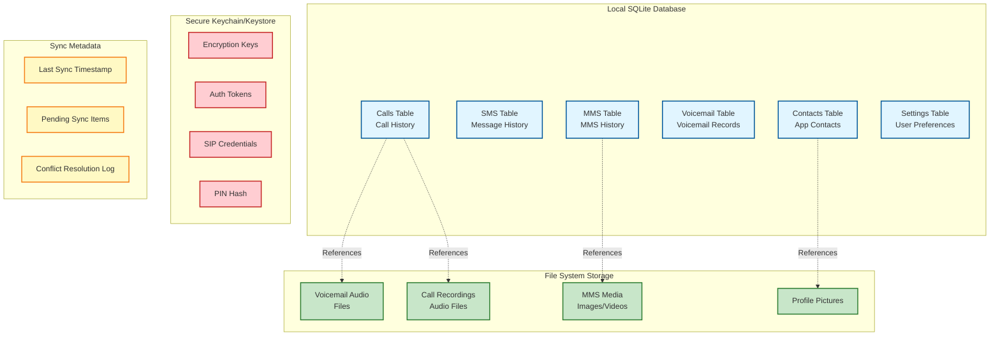
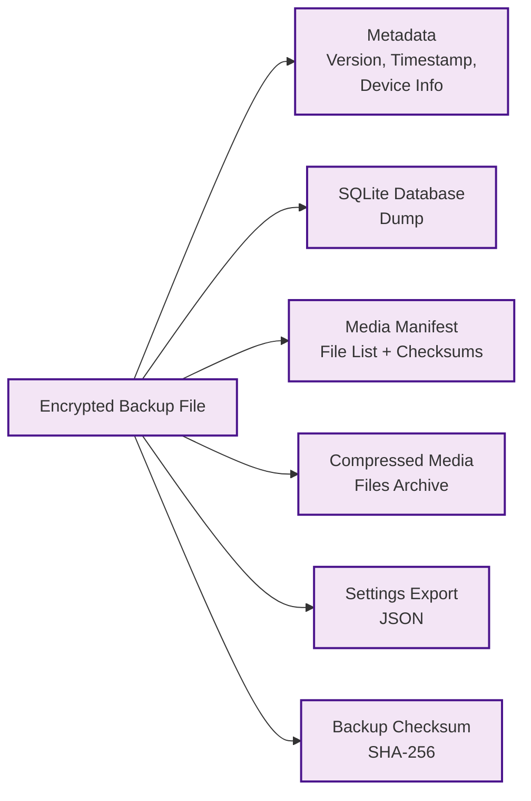
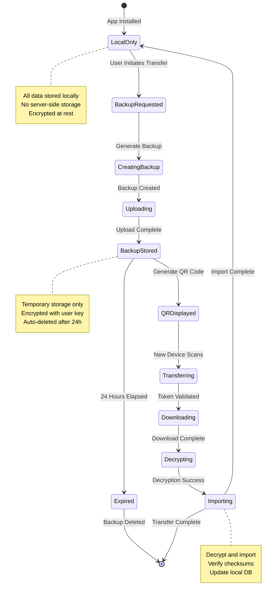
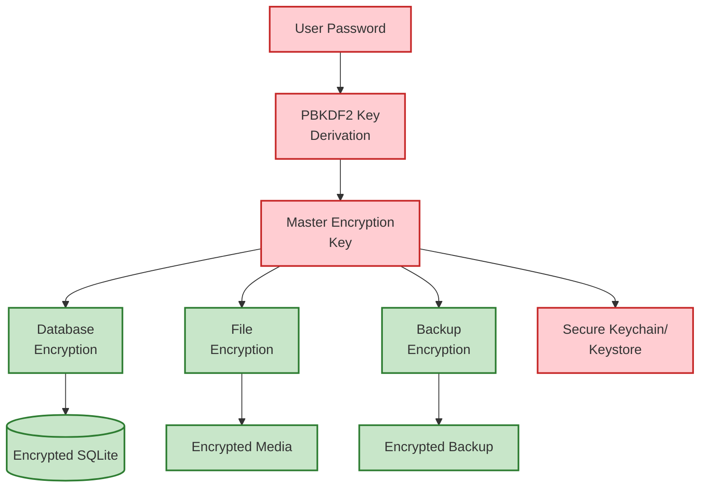

# Device Data Sync Architecture

## Overview
Architecture for device-local data storage and encrypted backup/transfer between devices.

## Data Storage Architecture

## Device Transfer Flow

## Local Data Structure

## Backup Structure

## Data Sync Strategy

## Security Measures

### Encryption

## Key Features

### Local Storage
1. **Encrypted SQLite**: All structured data encrypted at rest
2. **File Encryption**: Media files encrypted individually
3. **Secure Keychain**: Credentials stored in platform secure storage
4. **No Cloud Sync**: Data stays on device unless explicitly transferred

### Device Transfer
1. **QR Code Pairing**: Simple, secure device-to-device transfer
2. **Time-Limited**: Transfer tokens expire after 24 hours
3. **One-Time Use**: Tokens invalidated after successful transfer
4. **Automatic Cleanup**: Server backups deleted immediately after transfer

### Data Integrity
1. **Checksums**: SHA-256 checksums for all files
2. **Verification**: Data integrity verified during import
3. **Atomic Operations**: All-or-nothing import process
4. **Rollback**: Failed imports don't corrupt existing data

### Privacy
1. **User-Controlled**: User initiates all transfers
2. **End-to-End Encrypted**: Server cannot decrypt data
3. **Temporary Storage**: Server storage is temporary only
4. **Audit Logging**: All transfers logged for security
