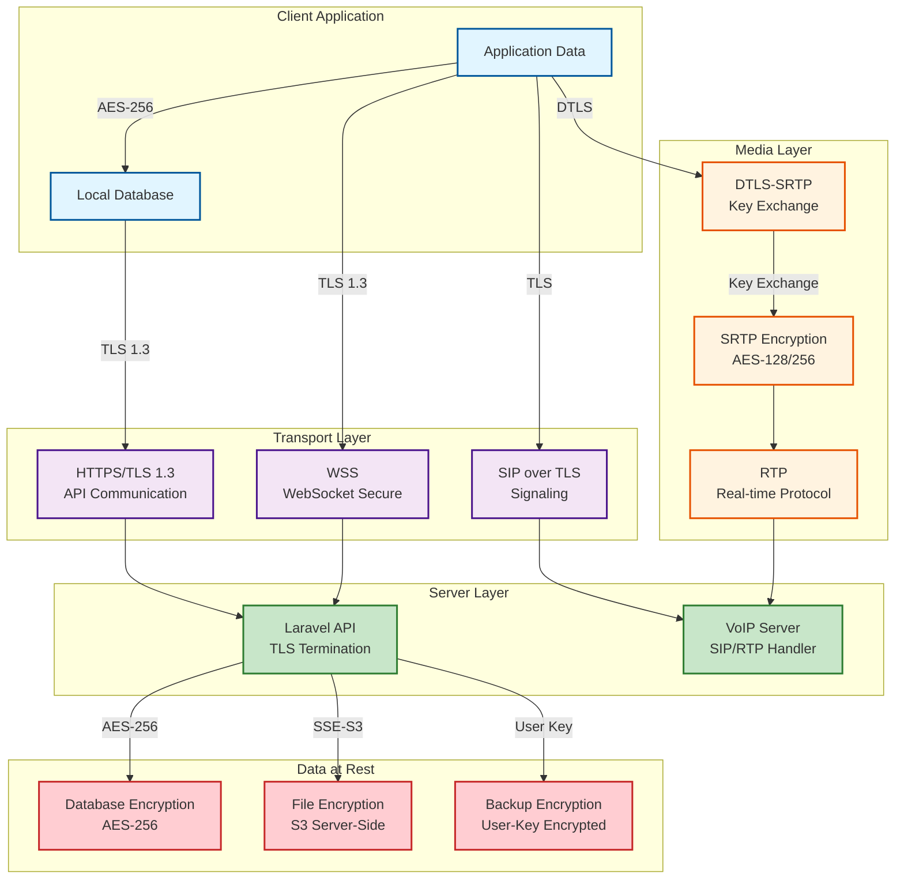
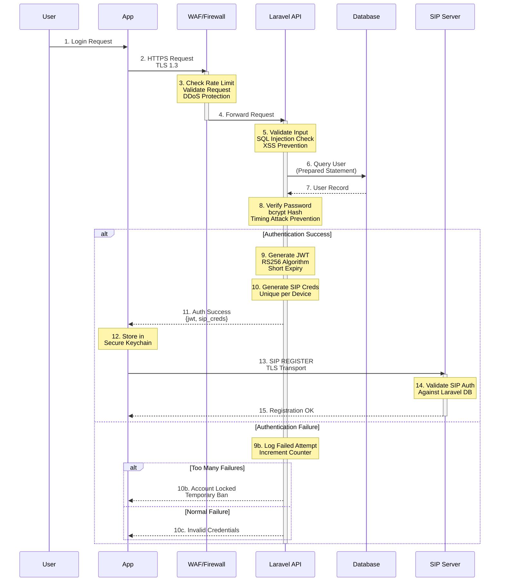
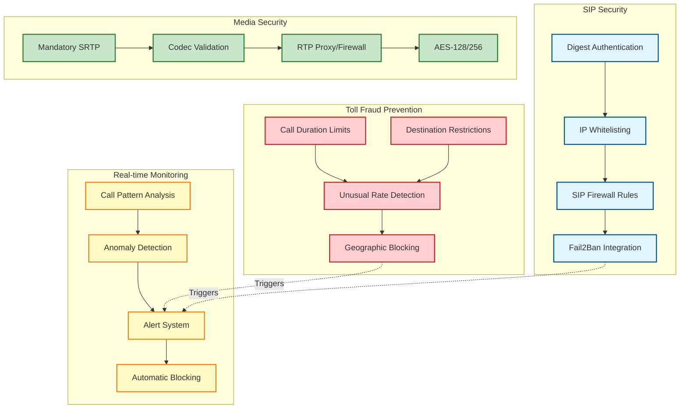

# Security Layers

## Overview
Multi-layered security architecture protecting the VoIP platform at every level.

## Security Architecture Overview

```mermaid
graph TB
    subgraph External["External Access"]
        Users[Users]
        Attackers[Potential Attackers]
    end
    
    subgraph Layer1["Layer 1: Network Security"]
        Firewall[Firewall<br/>Port Filtering]
        DDoS[DDoS Protection<br/>Rate Limiting]
        WAF[Web Application<br/>Firewall]
    end
    
    subgraph Layer2["Layer 2: Transport Security"]
        TLS[TLS 1.3<br/>HTTPS/WSS]
        CertPinning[Certificate<br/>Pinning]
        SRTP[SRTP<br/>Media Encryption]
    end
    
    subgraph Layer3["Layer 3: Application Security"]
        Auth[JWT Authentication]
        RBAC[Role-Based<br/>Access Control]
        RateLimit[API Rate<br/>Limiting]
        InputVal[Input Validation<br/>& Sanitization]
    end
    
    subgraph Layer4["Layer 4: Data Security"]
        EncryptRest[Encryption<br/>at Rest]
        EncryptTransit[Encryption<br/>in Transit]
        KeyMgmt[Key Management]
        DataMask[Data Masking]
    end
    
    subgraph Layer5["Layer 5: VoIP Security"]
        SIPAuth[SIP Authentication]
        MediaEncrypt[Media Encryption]
        TollFraud[Toll Fraud<br/>Prevention]
        CallAuth[Call Authorization]
    end
    
    subgraph Layer6["Layer 6: Monitoring & Response"]
        Logging[Audit Logging]
        SIEM[Security Information<br/>& Event Management]
        Alerts[Real-time Alerts]
        Incident[Incident Response]
    end
    
    Users --> Firewall
    Attackers -.->|Blocked| Firewall
    
    Firewall --> DDoS
    DDoS --> WAF
    
    WAF --> TLS
    TLS --> CertPinning
    CertPinning --> SRTP
    
    SRTP --> Auth
    Auth --> RBAC
    RBAC --> RateLimit
    RateLimit --> InputVal
    
    InputVal --> EncryptRest
    EncryptRest --> EncryptTransit
    EncryptTransit --> KeyMgmt
    KeyMgmt --> DataMask
    
    DataMask --> SIPAuth
    SIPAuth --> MediaEncrypt
    MediaEncrypt --> TollFraud
    TollFraud --> CallAuth
    
    CallAuth --> Logging
    Logging --> SIEM
    SIEM --> Alerts
    Alerts --> Incident

    classDef networkStyle fill:#ffcdd2,stroke:#c62828,stroke-width:2px
    classDef transportStyle fill:#f3e5f5,stroke:#4a148c,stroke-width:2px
    classDef appStyle fill:#e1f5ff,stroke:#01579b,stroke-width:2px
    classDef dataStyle fill:#c8e6c9,stroke:#2e7d32,stroke-width:2px
    classDef voipStyle fill:#fff3e0,stroke:#e65100,stroke-width:2px
    classDef monitorStyle fill:#fff9c4,stroke:#f57f17,stroke-width:2px

    class Firewall,DDoS,WAF networkStyle
    class TLS,CertPinning,SRTP transportStyle
    class Auth,RBAC,RateLimit,InputVal appStyle
    class EncryptRest,EncryptTransit,KeyMgmt,DataMask dataStyle
    class SIPAuth,MediaEncrypt,TollFraud,CallAuth voipStyle
    class Logging,SIEM,Alerts,Incident monitorStyle
```

## Encryption Stack

## Authentication & Authorization Flow

## VoIP Security Measures

## Data Protection

```mermaid
graph LR
    subgraph Collection["Data Collection"]
        UserInput[User Input]
        APIData[API Data]
        CallData[Call/SMS Data]
    end
    
    subgraph Validation["Validation & Sanitization"]
        InputVal[Input Validation]
        SQLPrevention[SQL Injection<br/>Prevention]
        XSSPrevention[XSS Prevention]
        CSRFProtection[CSRF Protection]
    end
    
    subgraph Storage["Secure Storage"]
        Encrypted[(Encrypted DB)]
        Hashed[Hashed Passwords]
        Tokenized[Tokenized PII]
    end
    
    subgraph Access["Access Control"]
        RBAC[Role-Based<br/>Access Control]
        FieldLevel[Field-Level<br/>Permissions]
        AuditLog[Audit Logging]
    end
    
    subgraph Transmission["Secure Transmission"]
        TLS[TLS 1.3]
        CertPin[Certificate<br/>Pinning]
        HSTS[HSTS Headers]
    end
    
    UserInput --> InputVal
    APIData --> InputVal
    CallData --> InputVal
    
    InputVal --> SQLPrevention
    SQLPrevention --> XSSPrevention
    XSSPrevention --> CSRFProtection
    
    CSRFProtection --> Encrypted
    CSRFProtection --> Hashed
    CSRFProtection --> Tokenized
    
    Encrypted --> RBAC
    Hashed --> RBAC
    Tokenized --> RBAC
    
    RBAC --> FieldLevel
    FieldLevel --> AuditLog
    
    AuditLog --> TLS
    TLS --> CertPin
    CertPin --> HSTS

    classDef inputStyle fill:#e1f5ff,stroke:#01579b,stroke-width:2px
    classDef validStyle fill:#fff3e0,stroke:#e65100,stroke-width:2px
    classDef storageStyle fill:#c8e6c9,stroke:#2e7d32,stroke-width:2px
    classDef accessStyle fill:#f3e5f5,stroke:#4a148c,stroke-width:2px
    classDef transStyle fill:#ffcdd2,stroke:#c62828,stroke-width:2px

    class UserInput,APIData,CallData inputStyle
    class InputVal,SQLPrevention,XSSPrevention,CSRFProtection validStyle
    class Encrypted,Hashed,Tokenized storageStyle
    class RBAC,FieldLevel,AuditLog accessStyle
    class TLS,CertPin,HSTS transStyle
```

## Security Best Practices

### 1. Transport Layer Security
- **TLS 1.3**: Latest TLS version for all communications
- **Certificate Pinning**: Prevent MITM attacks in mobile apps
- **HSTS**: Force HTTPS connections
- **Perfect Forward Secrecy**: Ephemeral key exchange

### 2. Application Security
- **JWT Tokens**: Short-lived access tokens (1 hour)
- **Refresh Tokens**: Longer-lived, revocable (30 days)
- **Rate Limiting**: Prevent brute force attacks
- **Input Validation**: Whitelist-based validation
- **Output Encoding**: Prevent XSS attacks
- **CSRF Tokens**: Protect state-changing operations

### 3. VoIP Security
- **SIP Digest Auth**: Challenge-response authentication
- **SRTP Mandatory**: No unencrypted media
- **Toll Fraud Prevention**: Multiple detection mechanisms
- **Call Authorization**: Verify user permissions
- **Geographic Restrictions**: Block high-risk destinations

### 4. Data Security
- **Encryption at Rest**: AES-256 for all stored data
- **Password Hashing**: bcrypt with high cost factor
- **PII Tokenization**: Sensitive data tokenized
- **Secure Key Management**: Hardware security modules
- **Regular Key Rotation**: Automated key rotation

### 5. Monitoring & Response
- **Audit Logging**: All security events logged
- **SIEM Integration**: Centralized log analysis
- **Real-time Alerts**: Immediate notification of threats
- **Incident Response**: Documented procedures
- **Regular VAPT**: Quarterly security assessments

## Compliance

### GDPR Requirements
- ✅ Data encryption at rest and in transit
- ✅ Right to data export
- ✅ Right to deletion
- ✅ Consent management
- ✅ Data minimization
- ✅ Breach notification procedures

### Security Standards
- **OWASP Top 10**: Mitigations implemented
- **PCI DSS**: Payment data security (if applicable)
- **SOC 2**: Security controls framework
- **ISO 27001**: Information security management
