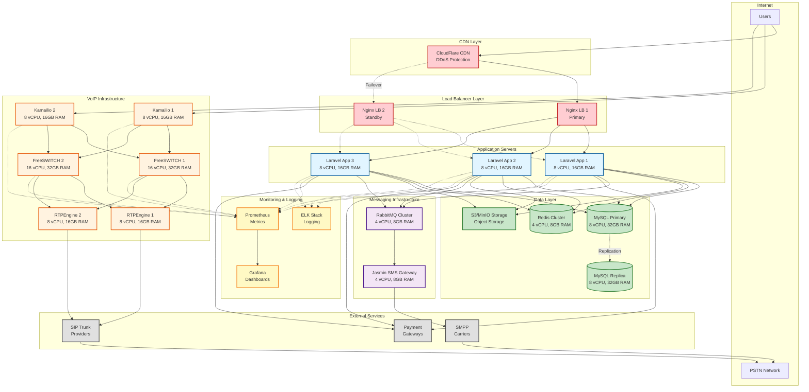
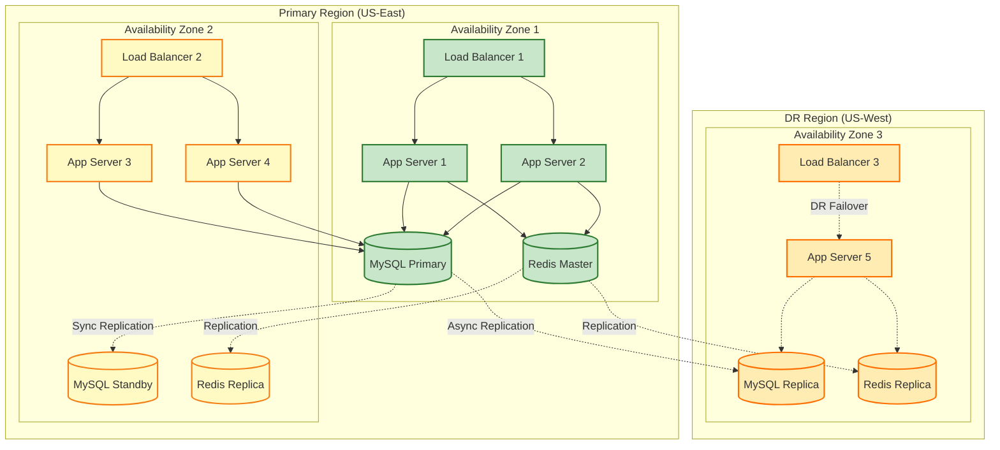
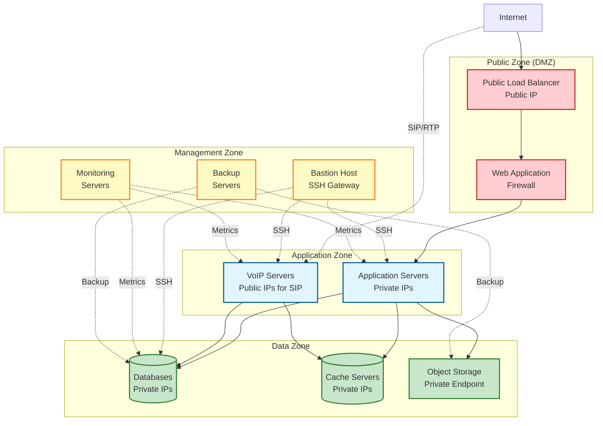
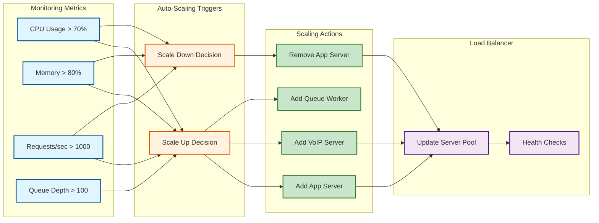

# Infrastructure Deployment

## Overview
Production infrastructure architecture with high availability and scalability.

## Complete Infrastructure Architecture

## High Availability Setup

## Network Architecture

## Scaling Strategy

## Server Specifications

### Production Environment

| Component | Quantity | Specs | Purpose |
|-----------|----------|-------|---------|
| **Load Balancer** | 2 | 4 vCPU, 8GB RAM | High availability |
| **Laravel App** | 3-10 | 8 vCPU, 16GB RAM | Auto-scaling |
| **MySQL Primary** | 1 | 8 vCPU, 32GB RAM, 1TB SSD | Main database |
| **MySQL Replica** | 2 | 8 vCPU, 32GB RAM, 1TB SSD | Read replicas |
| **Redis Cluster** | 3 | 4 vCPU, 8GB RAM | Cache & queues |
| **Kamailio** | 2 | 8 vCPU, 16GB RAM | SIP proxy HA |
| **FreeSWITCH** | 2-4 | 16 vCPU, 32GB RAM | Media servers |
| **RTPEngine** | 2-4 | 8 vCPU, 16GB RAM | RTP proxy |
| **Jasmin SMS** | 2 | 4 vCPU, 8GB RAM | SMS gateway |
| **RabbitMQ** | 3 | 4 vCPU, 8GB RAM | Message queue |
| **Monitoring** | 2 | 4 vCPU, 8GB RAM | Prometheus/Grafana |
| **Logging** | 3 | 8 vCPU, 16GB RAM | ELK stack |

### Development Environment

| Component | Quantity | Specs |
|-----------|----------|-------|
| **All-in-One** | 1 | 16 vCPU, 32GB RAM |

### Staging Environment

| Component | Quantity | Specs |
|-----------|----------|-------|
| **Load Balancer** | 1 | 2 vCPU, 4GB RAM |
| **Laravel App** | 2 | 4 vCPU, 8GB RAM |
| **MySQL** | 1 | 4 vCPU, 16GB RAM |
| **Redis** | 1 | 2 vCPU, 4GB RAM |
| **VoIP Stack** | 1 | 8 vCPU, 16GB RAM |

## Deployment Strategy

### Blue-Green Deployment
1. **Blue Environment**: Current production
2. **Green Environment**: New version deployed
3. **Testing**: Validate green environment
4. **Switch**: Update load balancer to green
5. **Rollback**: Switch back to blue if issues

### Rolling Deployment
1. Deploy to 1 server
2. Health check passes
3. Deploy to next server
4. Repeat until all updated
5. Automatic rollback on failure

## Backup Strategy

### Database Backups
- **Full Backup**: Daily at 2 AM UTC
- **Incremental**: Every 6 hours
- **Retention**: 30 days
- **Location**: S3 with cross-region replication

### File Backups
- **Media Files**: Continuous S3 replication
- **Configuration**: Git repository
- **Retention**: 90 days

### Disaster Recovery
- **RTO**: 4 hours (Recovery Time Objective)
- **RPO**: 1 hour (Recovery Point Objective)
- **DR Site**: Secondary region ready
- **Testing**: Quarterly DR drills
