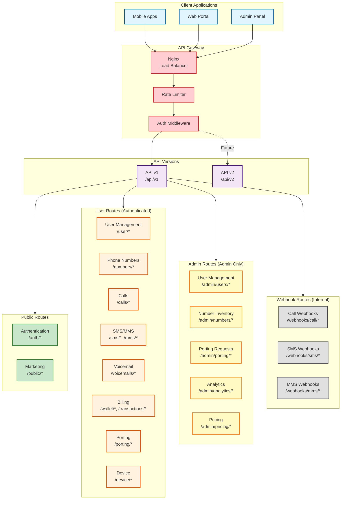
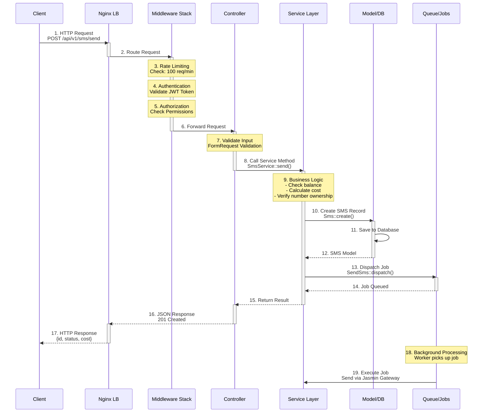
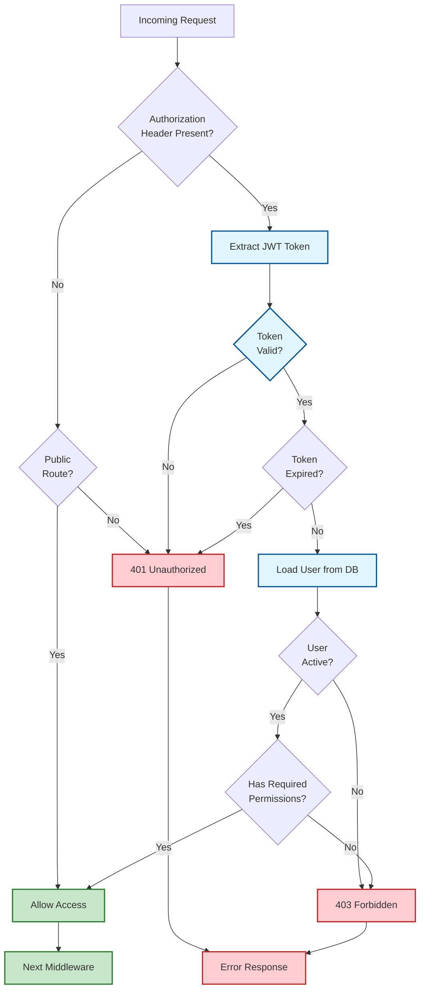
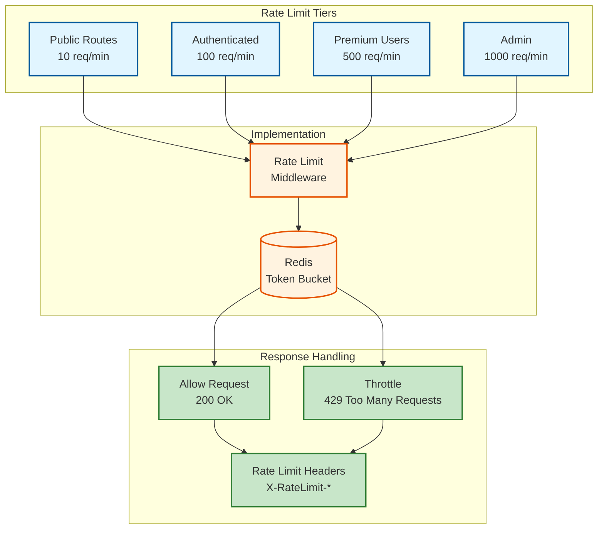

# API Structure

## Overview
Complete API endpoint organization and routing structure for the VoIP platform.

## API Architecture



## Complete API Endpoint Map

```mermaid
graph LR
    API[API v1<br/>/api/v1] --> Auth[Authentication]
    API --> User[User]
    API --> Numbers[Phone Numbers]
    API --> CallRules[Call Rules]
    API --> Calls[Calls]
    API --> SMS[SMS]
    API --> MMS[MMS]
    API --> Voicemail[Voicemail]
    API --> Billing[Billing]
    API --> Porting[Porting]
    API --> Device[Device]
    API --> Admin[Admin]
    API --> Webhooks[Webhooks]
    
    Auth --> AuthLogin[POST /auth/login]
    Auth --> AuthRegister[POST /auth/register]
    Auth --> AuthLogout[POST /auth/logout]
    Auth --> AuthRefresh[POST /auth/refresh]
    Auth --> AuthPin[POST /auth/pin/verify]
    Auth --> AuthQR[POST /auth/qr/generate<br/>POST /auth/qr/verify]
    
    User --> UserProfile[GET /user/profile<br/>PUT /user/profile]
    User --> UserPassword[PUT /user/password]
    User --> UserPin[PUT /user/pin]
    
    Numbers --> NumbersList[GET /numbers]
    Numbers --> NumbersSearch[GET /numbers/search]
    Numbers --> NumbersPurchase[POST /numbers/purchase]
    Numbers --> NumbersRelease[DELETE /numbers/{id}]
    Numbers --> NumbersPrimary[PUT /numbers/{id}/primary]
    Numbers --> NumbersStatus[PUT /numbers/{id}/status]
    
    CallRules --> RulesList[GET /numbers/{id}/rules]
    CallRules --> RulesCreate[POST /numbers/{id}/rules]
    CallRules --> RulesUpdate[PUT /numbers/{id}/rules/{ruleId}]
    CallRules --> RulesDelete[DELETE /numbers/{id}/rules/{ruleId}]
    
    Calls --> CallsList[GET /calls]
    Calls --> CallsInitiate[POST /calls/initiate]
    Calls --> CallsDetails[GET /calls/{id}]
    
    SMS --> SMSList[GET /sms]
    SMS --> SMSSend[POST /sms/send]
    SMS --> SMSSchedule[POST /sms/schedule]
    SMS --> SMSScheduledList[GET /sms/scheduled]
    SMS --> SMSCancel[DELETE /sms/scheduled/{id}]
    
    MMS --> MMSList[GET /mms]
    MMS --> MMSSend[POST /mms/send]
    MMS --> MMSDetails[GET /mms/{id}]
    
    Voicemail --> VoicemailList[GET /voicemails]
    Voicemail --> VoicemailGet[GET /voicemails/{id}]
    Voicemail --> VoicemailRead[PUT /voicemails/{id}/read]
    Voicemail --> VoicemailDelete[DELETE /voicemails/{id}]
    
    Billing --> WalletBalance[GET /wallet]
    Billing --> WalletRecharge[POST /wallet/recharge]
    Billing --> Transactions[GET /transactions]
    Billing --> Invoices[GET /invoices<br/>GET /invoices/{id}/download]
    
    Porting --> PortingRequest[POST /porting/request]
    Porting --> PortingStatus[GET /porting/status/{id}]
    Porting --> PortingCancel[DELETE /porting/cancel/{id}]
    
    Device --> DeviceRegister[POST /device/register]
    Device --> DeviceUnregister[DELETE /device/{id}]
    Device --> DeviceTransfer[POST /device/transfer/initiate<br/>POST /device/transfer/complete]
    
    Admin --> AdminUsers[GET /admin/users<br/>GET /admin/users/{id}]
    Admin --> AdminNumbers[GET /admin/numbers<br/>POST /admin/numbers/provision]
    Admin --> AdminPorting[GET /admin/porting<br/>POST /admin/porting/{id}/approve]
    Admin --> AdminAnalytics[GET /admin/analytics]
    Admin --> AdminPricing[GET /admin/pricing<br/>PUT /admin/pricing]
    
    Webhooks --> WebhookCall[POST /webhooks/call/status]
    Webhooks --> WebhookSMS[POST /webhooks/sms/inbound<br/>POST /webhooks/sms/status]
    Webhooks --> WebhookMMS[POST /webhooks/mms/inbound]
    Webhooks --> WebhookVoicemail[POST /webhooks/voicemail]

    classDef moduleStyle fill:#e1f5ff,stroke:#01579b,stroke-width:2px
    classDef endpointStyle fill:#c8e6c9,stroke:#2e7d32,stroke-width:2px

    class Auth,User,Numbers,CallRules,Calls,SMS,MMS,Voicemail,Billing,Porting,Device,Admin,Webhooks moduleStyle
```

## Request/Response Flow



## Authentication Middleware Flow



## Rate Limiting Strategy



## API Response Format

### Success Response
```json
{
  "success": true,
  "data": {
    "id": 123,
    "number": "+1234567890",
    "status": "active"
  },
  "meta": {
    "timestamp": "2024-01-15T10:30:00Z",
    "request_id": "req_abc123"
  }
}
```

### Error Response
```json
{
  "success": false,
  "error": {
    "code": "INSUFFICIENT_BALANCE",
    "message": "Insufficient wallet balance",
    "details": {
      "required": 5.00,
      "available": 2.50
    }
  },
  "meta": {
    "timestamp": "2024-01-15T10:30:00Z",
    "request_id": "req_abc123"
  }
}
```

### Paginated Response
```json
{
  "success": true,
  "data": [...],
  "pagination": {
    "current_page": 1,
    "per_page": 20,
    "total": 150,
    "total_pages": 8,
    "next_page": 2,
    "prev_page": null
  }
}
```

## HTTP Status Codes

| Code | Usage |
|------|-------|
| **200** | Successful GET, PUT, PATCH, DELETE |
| **201** | Successful POST (resource created) |
| **204** | Successful DELETE (no content) |
| **400** | Bad Request (invalid input) |
| **401** | Unauthorized (missing/invalid auth) |
| **403** | Forbidden (insufficient permissions) |
| **404** | Not Found |
| **409** | Conflict (duplicate resource) |
| **422** | Unprocessable Entity (validation error) |
| **429** | Too Many Requests (rate limited) |
| **500** | Internal Server Error |
| **503** | Service Unavailable |

## API Versioning Strategy

### URL Versioning
- Current: `/api/v1/...`
- Future: `/api/v2/...`
- Maintain backward compatibility for 1 year
- Deprecation warnings in response headers

### Version Lifecycle
1. **Active**: Current production version
2. **Deprecated**: Old version, still supported
3. **Sunset**: Version removed

## Documentation

- **OpenAPI/Swagger**: Auto-generated from code
- **Postman Collection**: Available for download
- **Interactive Docs**: Swagger UI at `/api/documentation`
- **Code Examples**: Available in multiple languages
