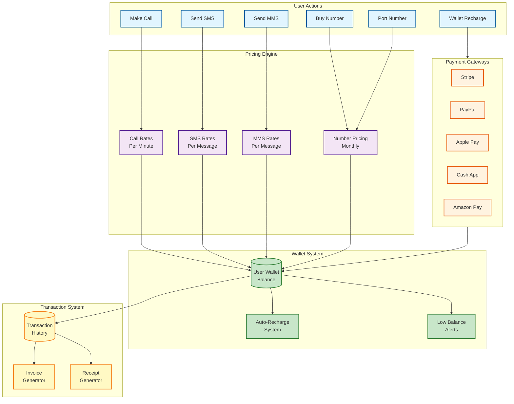
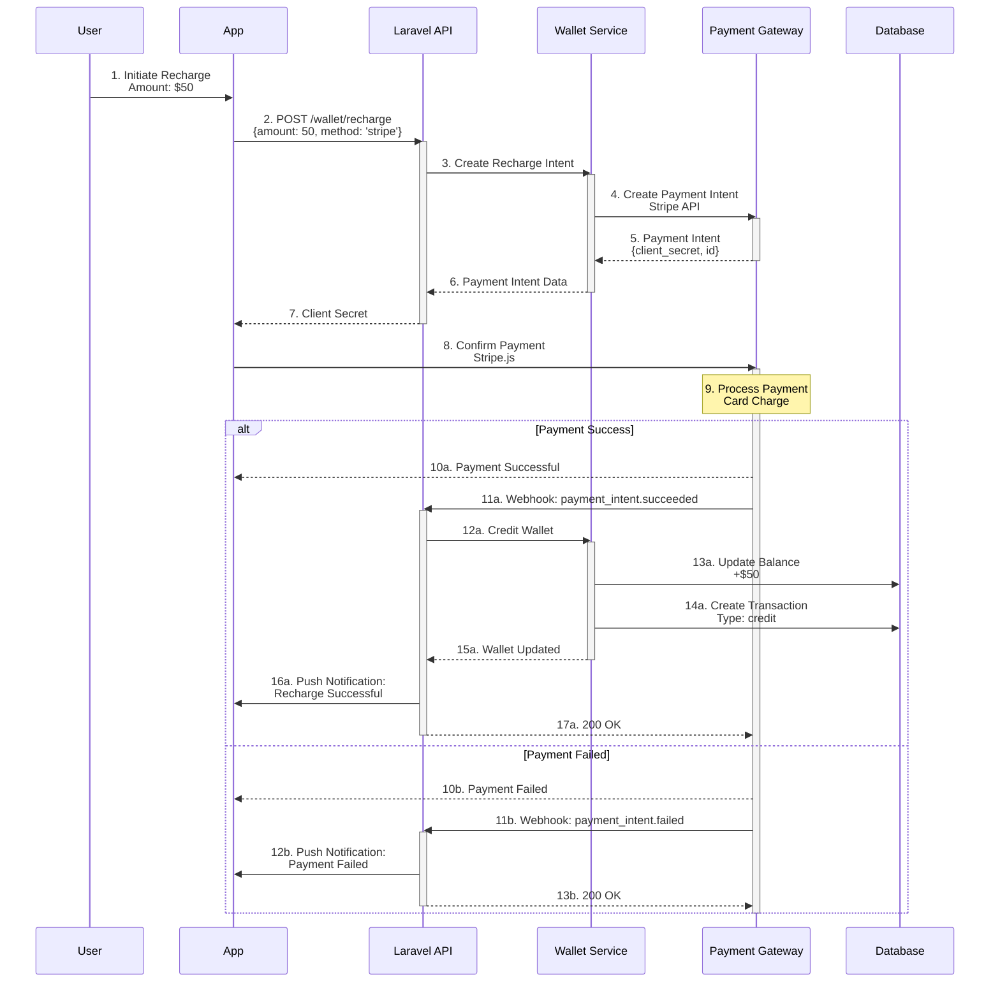
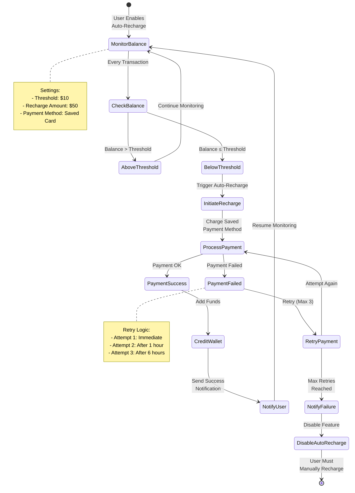
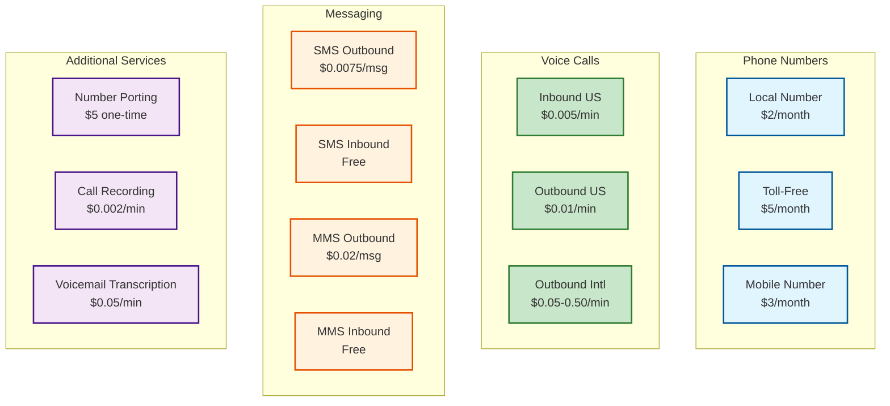
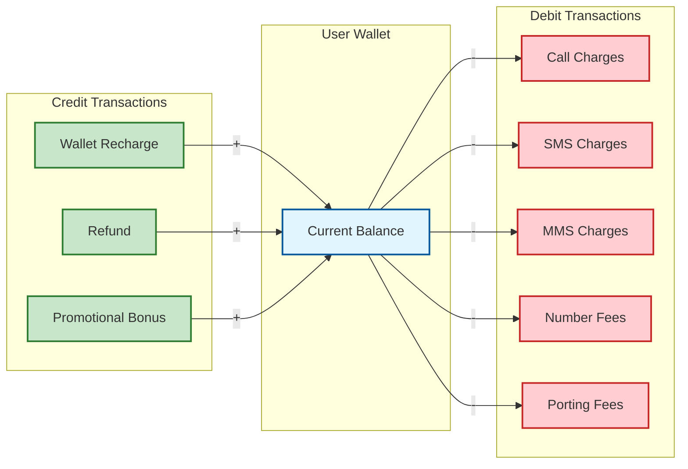
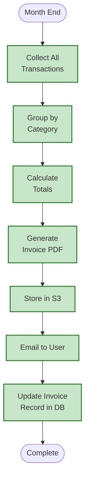

# Billing System

## Overview
Complete billing system architecture including wallet management, payment processing, and transaction tracking.

## Billing System Architecture



## Payment Flow



## Usage Billing Flow

```mermaid
sequenceDiagram
    participant User
    participant App
    participant Laravel as Laravel API
    participant Pricing as Pricing Engine
    participant Wallet as Wallet Service
    participant DB as Database

    Note over User,DB: Example: Outbound Call

    User->>App: 1. Initiate Call<br/>To: +1234567890
    
    App->>Laravel: 2. POST /calls/initiate<br/>{to, from}
    
    activate Laravel
    Laravel->>Pricing: 3. Calculate Cost<br/>Destination: +1234567890
    
    activate Pricing
    Note over Pricing: 4. Lookup Rate<br/>US: $0.01/min
    
    Pricing-->>Laravel: 5. Rate: $0.01/min
    deactivate Pricing
    
    Laravel->>Wallet: 6. Check Balance
    
    activate Wallet
    Wallet->>DB: 7. Get Wallet Balance
    
    DB-->>Wallet: 8. Balance: $25.00
    
    alt Sufficient Balance
        Wallet-->>Laravel: 9a. Balance OK
        deactivate Wallet
        
        Laravel->>Laravel: 10a. Create Call Record<br/>Status: initiated
        
        Laravel-->>App: 11a. Call Authorized<br/>Proceed
        
        Note over App: Call in Progress<br/>Duration: 5 minutes
        
        App->>Laravel: 12a. Call Ended<br/>Duration: 300 seconds
        
        Laravel->>Pricing: 13a. Calculate Final Cost<br/>5 min × $0.01
        
        activate Pricing
        Pricing-->>Laravel: 14a. Cost: $0.05
        deactivate Pricing
        
        Laravel->>Wallet: 15a. Deduct Amount
        
        activate Wallet
        Wallet->>DB: 16a. Update Balance<br/>$25.00 - $0.05
        
        Wallet->>DB: 17a. Create Transaction<br/>Type: debit, Amount: $0.05
        
        Wallet-->>Laravel: 18a. Balance Updated
        deactivate Wallet
        
        Laravel->>DB: 19a. Update Call Record<br/>Status: completed, Cost: $0.05
        
        Laravel-->>App: 20a. Call Complete
        
    else Insufficient Balance
        Wallet-->>Laravel: 9b. Insufficient Balance
        deactivate Wallet
        
        Laravel-->>App: 10b. Error: Low Balance<br/>Please recharge
    end
    
    deactivate Laravel
```

## Auto-Recharge System



## Pricing Structure



## Transaction Types



## Invoice Generation



## Payment Gateway Integration

### Supported Gateways

| Gateway | Features | Use Case |
|---------|----------|----------|
| **Stripe** | Cards, ACH, Apple Pay | Primary payment method |
| **PayPal** | PayPal balance, cards | Alternative payment |
| **Apple Pay** | iOS native | Mobile convenience |
| **Cash App** | Cash App balance | US market |
| **Amazon Pay** | Amazon account | Existing Amazon users |

### Payment Methods
- Credit/Debit Cards (Visa, Mastercard, Amex)
- ACH Bank Transfer
- Digital Wallets (Apple Pay, Google Pay)
- Cash App
- PayPal
- Amazon Pay

## Refund Policy

### Automatic Refunds
- Failed SMS/MMS delivery
- Call connection failures
- Number release (prorated)

### Manual Refunds
- User request (admin approval)
- Service issues
- Overcharges

### Refund Processing
1. User requests refund or automatic trigger
2. Admin reviews (if manual)
3. Refund approved
4. Credit back to wallet or original payment method
5. Transaction record created
6. User notified

## Financial Reports

### Available Reports
- Daily revenue summary
- Monthly financial statements
- Transaction history export
- Tax reports (by jurisdiction)
- Payment gateway reconciliation
- User spending analytics

### Report Formats
- PDF for invoices
- CSV for data export
- Excel for detailed analysis
- JSON via API
