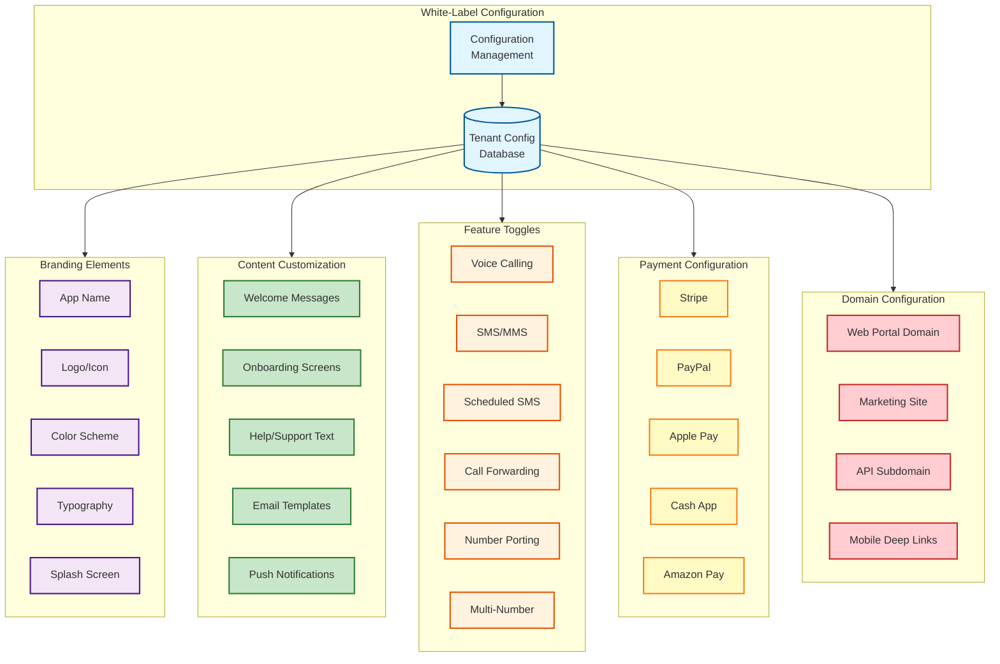
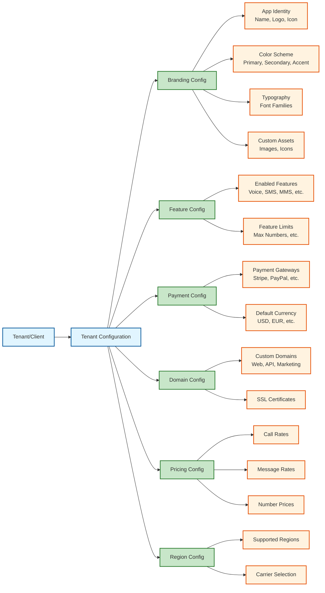
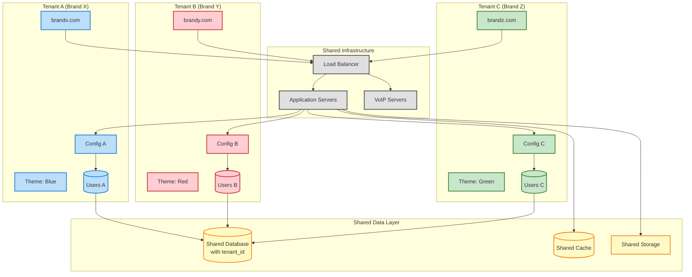
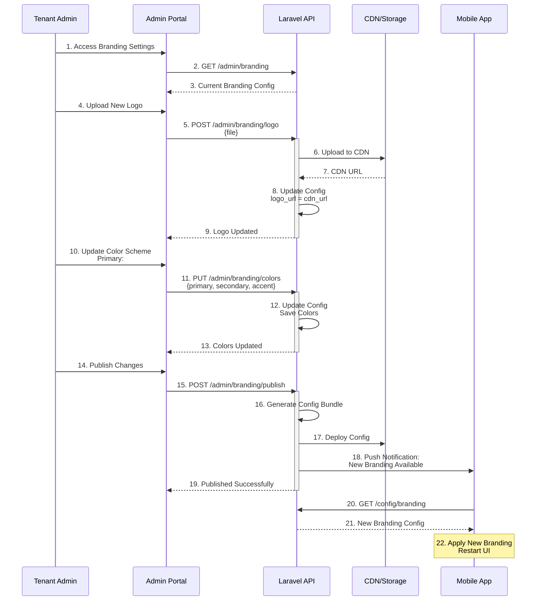

# White-Labeling Components

## Overview
Complete white-labeling system allowing full customization of the platform for different brands.

## White-Label Architecture



## Tenant Configuration Structure



## Multi-Tenant Data Isolation



## Branding Customization Flow



## Deployment Models

```mermaid
graph TB
    subgraph SaaS["SaaS Model"]
        SaaSInfra[Shared Infrastructure]
        SaaSTenants[Multiple Tenants]
        SaaSDB[(Single Database<br/>tenant_id column)]
        
        SaaSInfra --> SaaSTenants
        SaaSTenants --> SaaSDB
    end
    
    subgraph Dedicated["Dedicated Model"]
        DedInfra[Dedicated Infrastructure]
        DedTenant[Single Tenant]
        DedDB[(Dedicated Database)]
        
        DedInfra --> DedTenant
        DedTenant --> DedDB
    end
    
    subgraph OnPrem["On-Premise Model"]
        OnPremInfra[Client Infrastructure]
        OnPremTenant[Single Tenant]
        OnPremDB[(Client Database)]
        
        OnPremInfra --> OnPremTenant
        OnPremTenant --> OnPremDB
    end
    
    subgraph Hybrid["Hybrid Model"]
        HybridCore[Core on Cloud]
        HybridData[Data on Client]
        HybridVoIP[VoIP on Client]
        
        HybridCore --> HybridData
        HybridCore --> HybridVoIP
    end

    classDef saasStyle fill:#e1f5ff,stroke:#01579b,stroke-width:2px
    classDef dedicatedStyle fill:#c8e6c9,stroke:#2e7d32,stroke-width:2px
    classDef onpremStyle fill:#fff3e0,stroke:#e65100,stroke-width:2px
    classDef hybridStyle fill:#f3e5f5,stroke:#4a148c,stroke-width:2px

    class SaaSInfra,SaaSTenants,SaaSDB saasStyle
    class DedInfra,DedTenant,DedDB dedicatedStyle
    class OnPremInfra,OnPremTenant,OnPremDB onpremStyle
    class HybridCore,HybridData,HybridVoIP hybridStyle
```



## Configuration Management

### Configuration Hierarchy
```
Global Config (Platform-wide)
  └── Tenant Config (Brand-specific)
      └── User Config (User preferences)
```

### Configuration Storage
```json
{
  "tenant_id": "brand_x",
  "branding": {
    "app_name": "Brand X VoIP",
    "company_name": "Brand X Inc.",
    "logo_url": "https://cdn.example.com/brandx/logo.png",
    "icon_url": "https://cdn.example.com/brandx/icon.png",
    "splash_screen_url": "https://cdn.example.com/brandx/splash.png",
    "colors": {
      "primary": "#1976D2",
      "secondary": "#424242",
      "accent": "#FF4081"
    },
    "typography": {
      "primary_font": "Roboto",
      "secondary_font": "Open Sans"
    }
  },
  "features": {
    "voice_calling": true,
    "sms": true,
    "mms": true,
    "scheduled_sms": true,
    "call_forwarding": true,
    "number_porting": true,
    "multi_number": true,
    "max_numbers_per_user": 5
  },
  "payment_gateways": {
    "stripe": {
      "enabled": true,
      "public_key": "pk_live_...",
      "webhook_secret": "whsec_..."
    },
    "paypal": {
      "enabled": true,
      "client_id": "..."
    }
  },
  "domains": {
    "web_portal": "portal.brandx.com",
    "marketing_site": "www.brandx.com",
    "api": "api.brandx.com"
  },
  "support": {
    "email": "support@brandx.com",
    "phone": "+1-800-BRANDX",
    "url": "https://help.brandx.com"
  }
}
```

## Customizable Components

### Mobile App
- App name and bundle ID
- App icon and splash screen
- Color scheme
- Typography
- Onboarding flow
- Feature availability
- Deep link scheme

### Web Portal
- Domain and branding
- Theme colors
- Logo and favicon
- Custom CSS
- Feature toggles
- Help documentation

### Marketing Site
- Custom domain
- Complete design control
- SEO settings
- Analytics integration
- Content management

### Email Templates
- Branded email design
- Custom sender name/email
- Localized content
- Dynamic content blocks

## White-Label Management

### Admin Capabilities
- Create new tenant
- Configure branding
- Enable/disable features
- Set pricing
- Manage domains
- Monitor usage
- Generate reports

### Tenant Isolation
- Data segregation by tenant_id
- Separate file storage paths
- Isolated cache keys
- Tenant-specific queues
- Independent rate limits

### Billing
- Per-tenant billing
- Custom pricing models
- Revenue sharing options
- Usage-based pricing
- Subscription tiers
