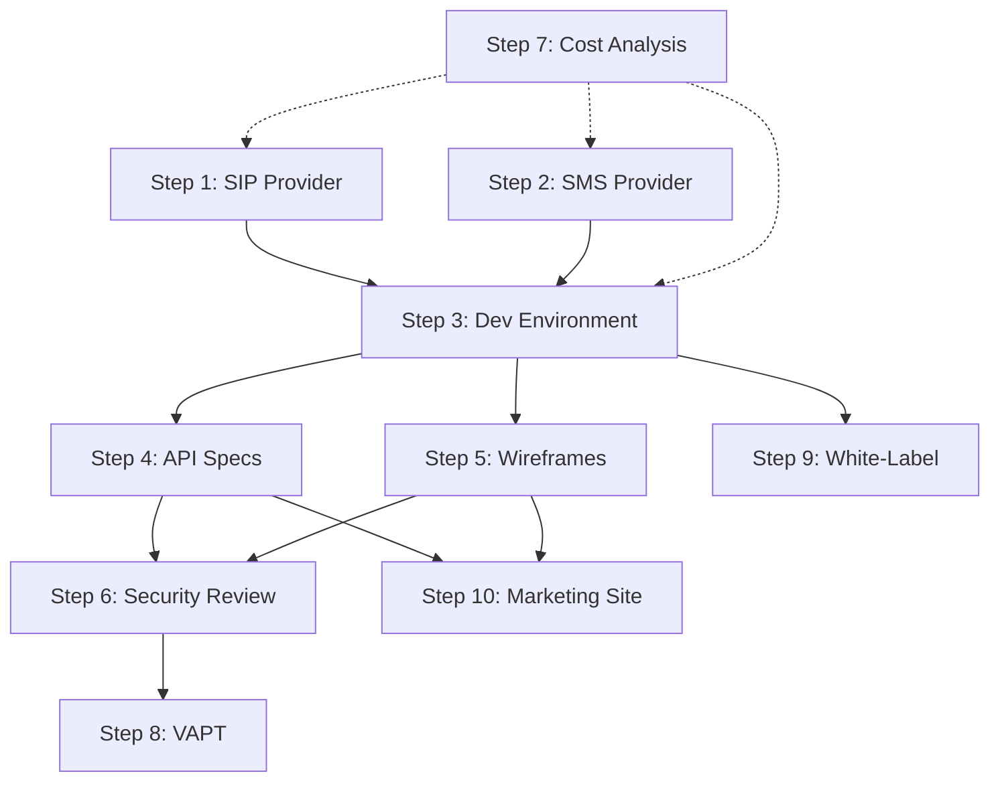

# VoIP Platform - Planning Steps Index

## Overview

This directory contains detailed planning documents for each critical step in the VoIP platform development process. Each document provides comprehensive guidance, checklists, and implementation details.

---

## Planning Steps

### [Step 1: SIP Trunk Provider Evaluation](./01-SIP-TRUNK-PROVIDER-EVALUATION.md)

**Objective:** Select the optimal SIP trunk provider for voice connectivity

**Key Topics:**
- Evaluation criteria (coverage, technical capabilities, reliability, pricing)
- Provider comparison (Bandwidth, Telnyx, Twilio, Plivo, SignalWire, VoIP.ms)
- Decision matrix and scoring
- Implementation checklist
- Cost estimation

**Timeline:** 4 weeks  
**Recommended Provider:** Telnyx (primary), Bandwidth (backup)

---

### [Step 2: SMS/MMS Provider Evaluation](./02-SMS-MMS-PROVIDER-EVALUATION.md)

**Objective:** Finalize SMS/MMS provider and establish SMPP connections

**Key Topics:**
- SMPP vs HTTP API comparison
- Provider evaluation (Telnyx, MessageBird, Bandwidth, Plivo, Infobip)
- Jasmin SMS Gateway setup
- Laravel integration
- Delivery receipt handling
- Cost estimation

**Timeline:** 3 weeks  
**Recommended Solution:** Jasmin + Telnyx (SMPP)

---

### [Step 3: Development Environment Setup](./03-DEVELOPMENT-ENVIRONMENT-SETUP.md)

**Objective:** Set up complete development environment for Laravel + VoIP stack

**Key Topics:**
- System requirements
- Laravel application setup (PHP 8.2+, Composer, Node.js)
- Database setup (MySQL 8.0)
- Redis configuration
- VoIP infrastructure (Kamailio, FreeSWITCH, RTPEngine, Coturn)
- Jasmin SMS Gateway
- Docker Compose alternative
- Testing and verification

**Timeline:** 2 weeks  
**Complexity:** High

---

### [Step 4: API Specifications](./04-API-SPECIFICATIONS.md)

**Objective:** Create detailed API specifications using OpenAPI/Swagger

**Key Topics:**
- OpenAPI 3.0 setup with L5-Swagger
- API documentation structure
- Authentication endpoints
- Phone number endpoints
- Call endpoints
- SMS/MMS endpoints
- Schema definitions
- Best practices (response format, status codes, versioning)
- Testing and validation

**Timeline:** 3 weeks  
**Deliverable:** Complete Swagger documentation

---

### [Step 5: Mobile App Wireframes](./05-MOBILE-APP-WIREFRAMES.md)

**Objective:** Design UX/UI wireframes for Android & iOS applications

**Key Topics:**
- Design principles and system
- App structure and navigation
- Screen wireframes (onboarding, dialer, calls, messages, numbers, settings)
- Platform-specific guidelines (iOS HIG, Material Design)
- Prototyping
- Accessibility
- Design tools (Figma, Adobe XD, Sketch)

**Timeline:** 4 weeks  
**Deliverables:** Wireframes, mockups, interactive prototype

---

### [Step 6: Security Architecture Review](./06-SECURITY-ARCHITECTURE-REVIEW.md)

**Objective:** Comprehensive security review before implementation

**Key Topics:**
- Application security (authentication, input validation, API security)
- Network security (TLS, VoIP security, toll fraud prevention)
- Data security (encryption at rest/transit, retention, deletion)
- Infrastructure security (server hardening, database security, monitoring)
- Compliance (GDPR, PCI DSS)
- Security testing (SAST, DAST, penetration testing)
- Incident response plan

**Timeline:** 2 weeks  
**Criticality:** High

---

### [Step 7: Cost Analysis](./07-COST-ANALYSIS.md)

**Objective:** Analyze infrastructure and carrier costs

**Key Topics:**
- Infrastructure costs (servers, storage, bandwidth)
- Carrier costs (voice, phone numbers, SMS/MMS)
- Third-party services
- Development and operations
- Total cost summary (1K users, 10K users)
- Revenue model and pricing strategy
- Break-even analysis
- Cost optimization strategies

**Timeline:** 1 week  
**Key Metric:** Break-even at ~2,712 users

---

### [Step 8: VAPT Planning](./08-VAPT-PLANNING.md)

**Objective:** Schedule and plan security testing cycles

**Key Topics:**
- VAPT scope (application, network, data, infrastructure)
- Methodology (VA + PT)
- Pre-launch VAPT (4 weeks)
- Ongoing VAPT cycles (quarterly, post-release)
- Vulnerability classification (CVSS)
- Remediation process
- Bug bounty program
- Budget estimation

**Timeline:** Ongoing  
**Budget:** $115,000/year

---

### [Step 9: White-Label Configuration](./09-WHITE-LABEL-CONFIGURATION.md)

**Objective:** Define comprehensive white-labeling and customization options

**Key Topics:**
- Branding customization (logo, colors, typography)
- Content customization (text, emails, templates)
- Feature configuration (toggles, pricing, payment gateways)
- Domain and URL customization
- Regional configuration (localization, restrictions)
- Mobile app customization
- Deployment models (SaaS, Dedicated, On-Premise, Hybrid)
- Configuration management

**Timeline:** 3 weeks  
**Complexity:** High

---

### [Step 10: Marketing Website Design](./10-MARKETING-WEBSITE-DESIGN.md)

**Objective:** Create high-converting landing pages and content

**Key Topics:**
- Site structure and information architecture
- Page designs (homepage, features, pricing, use cases, resources)
- Design system (colors, typography, components)
- Content strategy and SEO optimization
- Technical implementation (Next.js, Tailwind CSS, CMS)
- Performance optimization
- Launch checklist

**Timeline:** 4 weeks  
**Budget:** $18,000 (one-time) + $20/month

---

## Overall Timeline

### Phase 1: Planning & Setup (Weeks 1-8)

| Week | Activities |
|------|------------|
| 1-4 | Step 1: SIP Trunk Provider Evaluation |
| 3-5 | Step 2: SMS/MMS Provider Evaluation |
| 5-6 | Step 3: Development Environment Setup |
| 6-7 | Step 6: Security Architecture Review |
| 7 | Step 7: Cost Analysis |

### Phase 2: Design & Documentation (Weeks 9-16)

| Week | Activities |
|------|------------|
| 9-11 | Step 4: API Specifications |
| 12-15 | Step 5: Mobile App Wireframes |
| 14-16 | Step 10: Marketing Website Design |
| 15-17 | Step 9: White-Label Configuration |

### Phase 3: Security & Launch Prep (Weeks 17-20)

| Week | Activities |
|------|------------|
| 17-20 | Step 8: VAPT Planning (Pre-launch testing) |
| 18-20 | Final preparations and launch readiness |

**Total Duration:** ~20 weeks (5 months)

---

## Dependencies

---

## Success Criteria

### Step 1: SIP Trunk Provider
- ✅ Provider selected and contract signed
- ✅ Test account configured
- ✅ Call quality validated
- ✅ Pricing confirmed

### Step 2: SMS/MMS Provider
- ✅ SMPP connections established
- ✅ Jasmin gateway configured
- ✅ Test messages sent/received
- ✅ Delivery receipts working

### Step 3: Development Environment
- ✅ All services running
- ✅ End-to-end call flow tested
- ✅ SMS sending/receiving tested
- ✅ Team can develop locally

### Step 4: API Specifications
- ✅ Swagger documentation complete
- ✅ All endpoints documented
- ✅ Frontend team reviewed
- ✅ Postman collection generated

### Step 5: Mobile App Wireframes
- ✅ All screens designed
- ✅ Interactive prototype created
- ✅ User testing completed
- ✅ Developer handoff ready

### Step 6: Security Architecture Review
- ✅ Security controls defined
- ✅ Threat model created
- ✅ Compliance requirements met
- ✅ Incident response plan ready

### Step 7: Cost Analysis
- ✅ All costs estimated
- ✅ Pricing strategy defined
- ✅ Break-even point calculated
- ✅ Stakeholder approval

### Step 8: VAPT Planning
- ✅ VAPT schedule created
- ✅ Testing team selected
- ✅ Pre-launch VAPT completed
- ✅ Critical vulnerabilities fixed

### Step 9: White-Label Configuration
- ✅ All customization options defined
- ✅ Configuration system implemented
- ✅ Demo environment created
- ✅ Client onboarding guide ready

### Step 10: Marketing Website
- ✅ All pages designed
- ✅ Content written
- ✅ SEO optimized
- ✅ Website launched

---

## Budget Summary

| Step | One-Time Cost | Monthly Cost |
|------|---------------|--------------|
| 1. SIP Provider | - | $510 (1K users) |
| 2. SMS Provider | - | $864 (1K users) |
| 3. Dev Environment | $5,000 | $1,624 (infrastructure) |
| 4. API Specs | - | - |
| 5. Wireframes | $26,000 | - |
| 6. Security Review | $10,000 | - |
| 7. Cost Analysis | - | - |
| 8. VAPT | $25,000 | $7,500 (quarterly avg) |
| 9. White-Label | - | - |
| 10. Marketing Site | $18,000 | $20 |
| **Total** | **$84,000** | **~$10,518** |

*Note: Monthly costs shown for 1,000 users. See Step 7 for detailed breakdown.*

---

## Next Steps

After completing all planning steps:

1. ✅ Review and approve all documents
2. ✅ Finalize contracts with providers
3. ✅ Allocate budget and resources
4. ✅ Assemble development team
5. ✅ Begin Phase 1 implementation
6. ✅ Set up project management (Jira/GitHub)
7. ✅ Establish communication channels (Slack)
8. ✅ Schedule regular check-ins
9. ✅ Track progress against timeline
10. ✅ Adjust plans as needed

---

## Document Maintenance

**Review Frequency:** Monthly during planning phase, quarterly after launch

**Update Triggers:**
- Provider pricing changes
- Technology stack changes
- Regulatory changes
- Significant feature additions
- Security incidents

**Version Control:**
- All documents in Git
- Semantic versioning
- Change log maintained

---

## Contact & Support

For questions or clarifications on any planning step:

- **Project Manager:** [Name]
- **Technical Lead:** [Name]
- **Security Lead:** [Name]
- **Product Owner:** [Name]

---

*Index Version: 1.0*  
*Created: February 2026*  
*Last Updated: February 2026*  
*Status: Complete*
